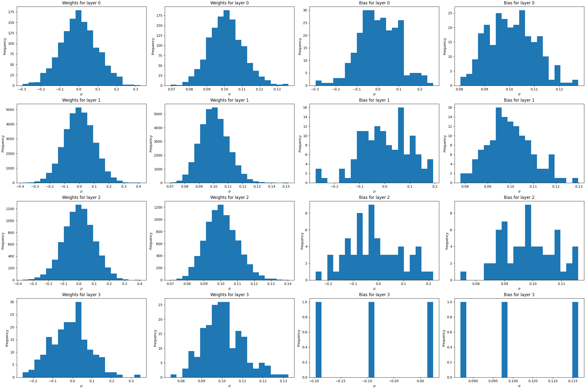
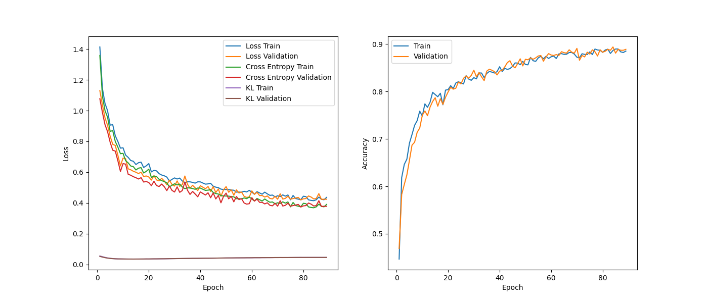

## Bayesian Neural Network

Bayesian Neural Networls (BNNs) are a kind of Neural Networks in which **weights** are not fixed: they are **probability distributions**. The Figure below shows an example of the same network architecture but the left one uses a classical approach and the right one a bayesian approach.

  

BNNs will typically be more **flexible** and capture better **uncertainty**, but one disadvantage is that they will have **twice** as many parameters as a classical NN because a mean and standard deviation is needed for each parameter.

We will assume parameters are distributed like a $N(0, 0.1)$ and choose that as a **prior**. The mean value, $\mu$, will be the same, but for the standard deviation $\sigma$, we will use $\sigma'=\log(1+\exp(\sigma))$ to allow negative values for $\sigma$. We will initialize $\mu\sim N(0,0.1)$ and $\sigma\sim N(\log(\exp(0.1)-1), 0.1)$. Note that this last initialization is because

$$\log(1+\exp(\sigma))=0.1 \implies \sigma=\log(\exp(0.1)-1).$$

We will also use the **reparametrization trick** to avoid problems in the backward pass. Just to remember, $N(\mu(x), \sigma(x))$ is the same as $\mu(x)+\varepsilon\cdot\sigma(x)$ when $\varepsilon\sim N(0, 1)$.

The **loss function** we will use consists of two parts. The first one is the **prediction loss**, which only takes into account the quality of the predictions, i.e., the cross entropy loss in this case. The second one is the **KL loss**, that is the mean KL divergence of the parameters of all the layers. We will use that the KL divergence between two normal distributions has a closed formula:

$$\text{KL}(N(\mu_1, \sigma_1), N(\mu_2, \sigma_2))=\log\left(\dfrac{\sigma_2}{\sigma_1}\right)+\dfrac{\sigma_1^2+(\mu_1-\mu_2)^2}{2\sigma_2^2}-\dfrac{1}{2}.$$

You can check the demonstration in this [link](https://stats.stackexchange.com/questions/7440/kl-divergence-between-two-univariate-gaussians).

One function is created to check the distribution of the model predictions given an input and the second one to visualize the $\mu$ and $\sigma$ values of the parameters of the model. They will serve as sanity checks (for example, we can see if the mean and std of the parameters are distributed more or less like the prior, a $N(0, 0.1)$):

  
  

Finally, there is also a function to see how **Bayesian Loss** (which takes into account KL divergence and BCE or Cross Entropy) evolves during training.

  

